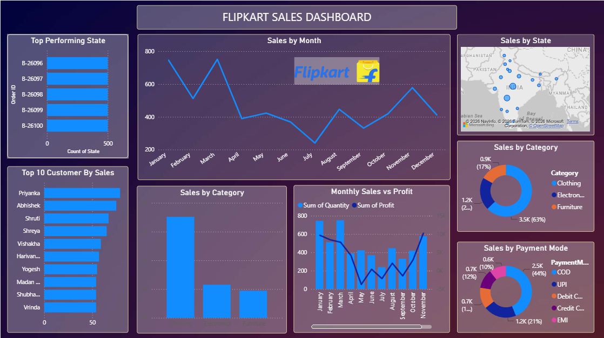

# 📊 Flipkart Sales Dashboard using Power BI



## 📌 Project Overview

The **Flipkart Sales Dashboard** is an interactive Business Intelligence solution built using **Microsoft Power BI**. It transforms raw sales data into meaningful business insights, helping stakeholders monitor sales performance, analyze customer behavior, evaluate product categories, and make data-driven decisions.

The dashboard provides an interactive and comprehensive view of sales, profit, payment methods, customer performance, and state-wise sales distribution.

---

## 🚀 Key Features

- 📈 Monthly Sales Trend Analysis
- 💰 Monthly Sales vs Profit Comparison
- 🏆 Top Performing States
- 👥 Top 10 Customers by Sales
- 📦 Category-wise Sales Analysis
- 💳 Payment Mode Distribution
- 🗺️ State-wise Sales Mapping
- 📊 Product Category Performance
- 🎛 Interactive Dashboard with Filters & Slicers

---

## 📊 Dashboard Insights

- Visualized monthly sales performance across the year.
- Compared monthly sales and profit to identify business trends.
- Identified top-performing states contributing to overall sales.
- Highlighted top customers based on total sales.
- Analyzed product category performance.
- Evaluated customer payment preferences.
- Visualized geographical sales distribution across India.
- Enabled interactive exploration through filters and slicers.

---

## 🛠️ Technologies Used

- Microsoft Power BI
- Power Query
- DAX (Data Analysis Expressions)
- Microsoft Excel

---

## 📁 Repository Structure

```text
flipkart-sales-dashboard-powerbi/
│
├── README.md
├── Flipkart Sales Dashboard.pbix
├── dataset/
│   ├── Orders_Data.xlsx
│   └── Details_Data.xlsx
└── images/
    └── dashboard-preview.png
```

---

## 📷 Dashboard Preview

The dashboard includes:

- 📈 Monthly Sales Trend
- 💰 Monthly Sales vs Profit
- 🏆 Top Performing States
- 👥 Top 10 Customers by Sales
- 📦 Sales by Category
- 💳 Sales by Payment Mode
- 🗺️ State-wise Sales Distribution
- 📊 Interactive Dashboard Visualizations

---

## 📂 Dataset

This project uses two datasets:

### 📄 Orders_Data.xlsx
Contains order-related information such as:

- Order ID
- Order Date
- Customer Name
- State
- Category
- Payment Mode

### 📄 Details_Data.xlsx
Contains transaction details including:

- Sales Amount
- Quantity
- Profit
- Product Category
- Sub-Category

---

## 💡 Business Value

This dashboard helps businesses to:

- Monitor sales performance in real time.
- Identify top-performing regions and customers.
- Analyze category-wise sales performance.
- Understand customer purchasing behavior.
- Evaluate payment method preferences.
- Support strategic business decisions through interactive visualizations.

---

## 📌 Future Improvements

- Add Year-over-Year sales comparison.
- Implement Sales Forecasting.
- Include Customer Retention Analysis.
- Build Executive KPI Dashboard.
- Improve Mobile Dashboard Responsiveness.

---

## 👨‍💻 Author

**Arpit Patel**

- GitHub: https://github.com/arpitpatel10

---

⭐ If you found this project useful, consider giving it a **Star**.
